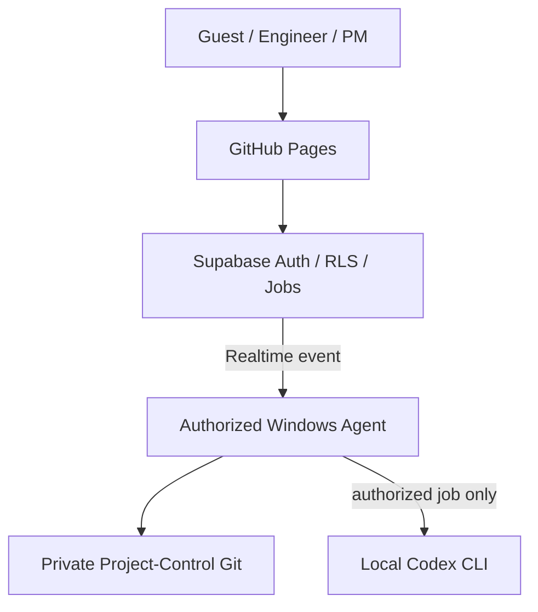

# SmartPort Progress Hub

SmartPort 專案的規劃、進度、Checkpoint、安全追溯與週報審核介面。

正式網站：<https://smartport-ntume.github.io/SmartPort-Progress-Hub/>

目前 `main` 為 v0.8 **Supabase Gateway + Windows Local Agent** 架構。一般使用者只需開啟網站，不必安裝程式、Tailscale，也不會直接連入 Agent 電腦。

## 使用方式

| 身分 | 登入方式 | 權限 |
|---|---|---|
| Guest | 專案管理者提供的訪客密碼 | 唯讀查看 Dashboard、Project、Requirements |
| Engineer | GitHub Login，且帳號已由管理者核准 | 查看完整資料、提交 Manual Proposal |
| PM | GitHub Login，且帳號已由管理者核准 | 編輯、審核與核准 Proposal |
| Codex operator | PM 且另有 `can_trigger_codex` 權限 | 上傳週報並排入本機 Codex 分析 |

GitHub 帳號第一次登入時預設為 `DENIED`；管理者必須在 Supabase 明確指定角色後才會開放。Guest 密碼與任何私密金鑰不得寫入此 repository。

## 系統架構



- Private Git 是正式資料來源；Supabase 只保存登入權限、公開介面所需快照、工作佇列及稽核資料。
- Windows Agent 持有 Private Git、GitHub Issues 與 Codex 權限，只建立對外 HTTPS / WebSocket 連線，不開公開 port。
- 開啟網頁與讀取既有快照不會啟動 Codex，也不需要 Agent 當下在線。
- Agent 離線時，需要寫入或分析的工作會留在 `gateway_jobs`；Agent 恢復連線後依序處理。
- Agent 使用 Realtime `INSERT` 事件；啟動或斷線重連時只補查一次未處理工作，不做 interval polling。
- Codex 只產生 Proposal；正式進度仍須 PM 檢查並 Approve。

## 成員與分工

PM 可在 **設定 / 備份 → 成員與分工** 維護專案名單與責任分派。名單只需要姓名與負責分類，不需要 GitHub 帳號或 email。

- 預設分類為 `CTL`（控制）、`LOC/NAV`（定位＋導航）、`PER`（感知）、`STM`（狀態機＋任務）；名稱、顏色與啟用狀態可調整。
- 已被既有 WP / Subtask 使用的其他分類會自動保留，例如 `VERIFY`，避免讀取舊資料時遺失工作。
- 每個 Subtask 最多指定一位主要負責人；一位成員可負責多個 Subtask，WP 只作彙整。
- 未指派的 Subtask 會明確標示。個人週報範圍預覽只列出該成員已指派、尚未完成，且已逾期或未來一個月內到期的項目。
- 儲存後由 Supabase Gateway 交給 Windows Agent，寫入 Private Project-Control repository 的 `project/team_config.json` 並 commit / push。
- Guest 快照只保留分類名稱與顏色；成員姓名與 Subtask 分派只提供給 Engineer / PM。

首次部署此功能前，請先在 Supabase SQL Editor 執行：

```text
supabase/migrations/202609080001_team_config.sql
```

接著更新並重啟 Windows Agent，再以 PM 帳號儲存第一份成員與分工設定。

## 週報分析

1. 以具有 Codex 權限的 PM 登入。
2. 前往 **Workflow → Weekly Reports**。
3. 選擇日期與團隊，上傳不超過 10 MB 的 `.docx`；舊 `.doc` 需由 Agent 電腦安裝 LibreOffice。
4. 按下分析後，Agent 會先把原始週報歸檔到 Private Git，再刪除 Supabase Storage 暫存檔。
5. 本機 Codex CLI 依專案資料產生 Proposal，最後由 PM 決定是否核准。

這是「在本機執行 Codex CLI」，不是離線模型。分析時，抽出的週報文字與必要 project context 會由 Codex CLI 傳送至 OpenAI 服務。

## 維運者快速開始

完整的 Supabase、角色、GitHub OAuth、`.env.local` 與 Windows Task Scheduler 設定，請看 [Supabase Gateway Windows Setup](docs/SUPABASE_GATEWAY_WINDOWS.md)。

在授權的 Windows 帳號下安裝 Agent：

```powershell
git clone --branch main https://github.com/smartport-ntume/SmartPort-Progress-Hub.git SmartPort-Progress-Hub-Agent
Set-Location SmartPort-Progress-Hub-Agent
npm install
Copy-Item .env.example .env.local

gh auth login
gh auth setup-git
codex login
```

填妥本機專用的 `.env.local` 後驗證並啟動：

```powershell
npm run check
npm test
npm run doctor
npm start
```

成功時會顯示：

```text
SmartPort Supabase Agent connected
Mode: Realtime events + reconnect catch-up; no interval polling
```

正式運行應使用 Windows Task Scheduler 啟動 `scripts/start-agent.ps1`。本機預覽 `npm run preview` 只供開發測試，一般使用者應直接開正式網站。

## 安全與免費額度護欄

- `SUPABASE_SERVICE_ROLE_KEY`、GitHub credential、Codex 登入資料只留在 Agent 電腦，不得進入前端、README、Issue 或 commit。
- `can_trigger_codex` 是獨立權限，預設關閉，只開給指定 operator。
- 不使用 Edge Functions、VPS、自訂網域或付費 add-on；Supabase project 應維持 Free plan。
- job payload/result 上限 4 MB、snapshot 上限 5 MB、週報單檔上限 10 MB。
- 已完成 job 保留 30 天、audit metadata 保留 90 天；Agent 啟動及每次工作完成後執行清理。
- 週報完成 Private Git 歸檔後立即刪除 Supabase Storage 暫存檔。

## 驗證

```powershell
npm run check
npm test
npm run doctor
```

測試涵蓋 Git 寫入衝突與 symlink 防護、內部 GitHub adapter、PM-only/Codex 權限、Realtime 事件處理、週報先歸檔後刪除暫存、CORS、static allowlist、未登入資料保護，以及 Guest 唯讀快照。

## 回復點

- 現行正式版本：`main`
- Supabase 上線前的舊 `main`：[`backup/main-before-supabase-2026-09-07`](https://github.com/smartport-ntume/SmartPort-Progress-Hub/tree/backup/main-before-supabase-2026-09-07)
- 舊版 branch 只作歷史回復點，不會跟隨 `main` 更新。
- 舊的 loopback HTTP backend 仍可用 `npm run start:local` 啟動；相關文件見 [Local Backend Windows](docs/LOCAL_BACKEND_WINDOWS.md)。

## Repositories

- Frontend / Local Agent：`smartport-ntume/SmartPort-Progress-Hub`
- Source of Truth：`smartport-ntume/SmartPort-Project-Control`（Private）
