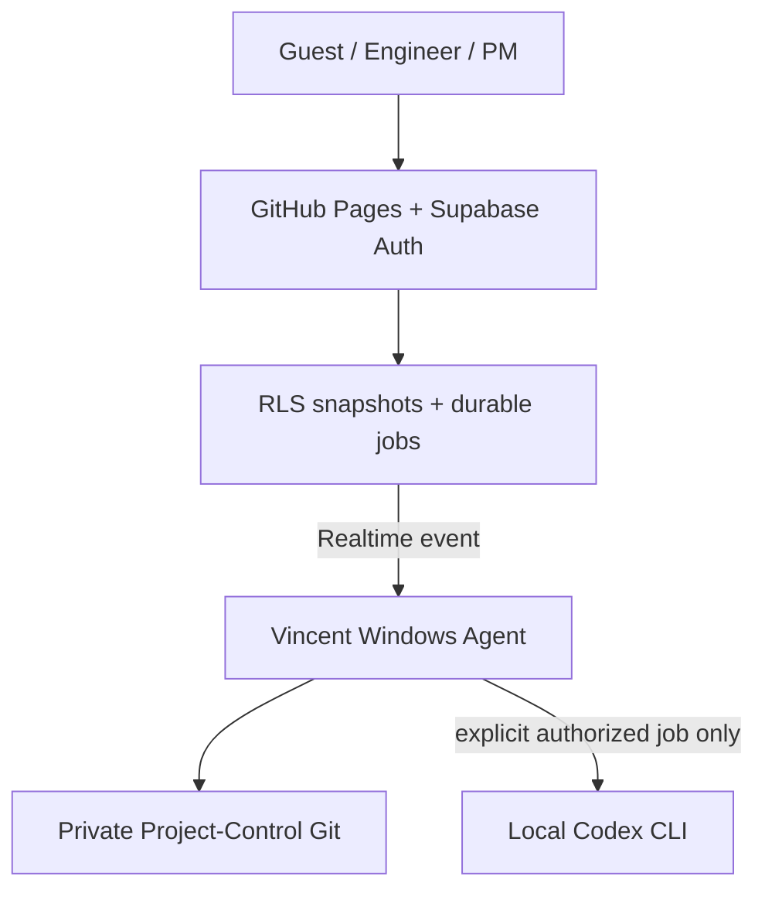

# SmartPort Progress Hub

SmartPort 專案的規劃、進度、Checkpoint、安全追溯與週報審核介面。

v0.8 使用 **Supabase Free 作為公開 Gateway**，Windows 本機只執行事件驅動 Agent。訪客、Engineer 與 PM 都只需開啟 GitHub Pages；不必安裝 Tailscale，也不會直接連入 Vincent 的電腦。



## 核心規則

- Private Git 仍是正式資料來源；Supabase 不保存整份 repository 或 Git 憑證。
- Guest 讀取與目前 `main` Guest 相同的完整唯讀專案內容；Engineer 可送 Manual Proposal；PM 可改 baseline 與審核。
- `can_trigger_codex` 是獨立權限，預設全部關閉，只應開給 Vincent。
- 本機 Agent 訂閱 Realtime `INSERT` 事件，不做 interval polling。啟動或斷線重連時只補查一次未處理工作。
- Agent 離線時操作會留在 `gateway_jobs`；電腦恢復連線後再依序處理。
- 週報暫存限制 10 MB。Agent 先寫入 Private Git，再刪除 Supabase Storage 暫存檔，之後才交給 Codex。
- Codex 只產生 Proposal；正式進度仍須 PM Approve。

## 開始使用

完整步驟請看 [Supabase Gateway Windows Setup](docs/SUPABASE_GATEWAY_WINDOWS.md)。摘要：

1. 建立 Supabase Free project，執行 `supabase/migrations/202609030001_gateway.sql`。
2. 設定 Supabase GitHub Auth、Guest user、PM / Engineer 角色與 Vincent 的 Codex 權限。
3. 將 public Project URL、publishable/anon key、Guest email 填入 `js/runtime-config.js` 後發布 GitHub Pages。
4. Windows 本機執行 `gh auth login`、`codex login`，填好 `.env.local`。
5. 執行：

```powershell
npm install
npm run check
npm test
npm run doctor
npm start
```

`npm start` 只建立對外的 Supabase WebSocket/HTTPS 連線，不開公開 port。舊的 loopback HTTP 後端仍可用 `npm run start:local` 啟動，僅作 rollback。

## 免費額度護欄

- 不使用 Edge Functions、VPS、自訂網域或付費 add-on。
- migration 同時限制 job payload/result 4 MB、snapshot 5 MB、週報單檔 10 MB。
- 已完成 job 保留 30 天、audit metadata 保留 90 天；Agent 啟動與每次操作完成後清理。
- 週報完成 Git archive 後立即刪除暫存，避免 Storage 持續累積。
- 請保持 Supabase project 在 Free plan，不升級、不啟用付費功能。Free plan 達限額時應受限制，而不是讓系統自行升級。

## 驗證

```powershell
npm run check
npm test
npm run doctor
```

測試涵蓋 Git 寫入衝突與 symlink 防護、內部 GitHub adapter、PM-only/Codex 權限 SQL、Realtime 事件處理、週報先歸檔後刪暫存、CORS、static allowlist、公開快照去敏感化，以及 Supabase Guest 與 `main` Guest 的內容一致性。

## Repositories

- Frontend / Local Agent: `smartport-ntume/SmartPort-Progress-Hub`
- Source of Truth: `smartport-ntume/SmartPort-Project-Control`（Private）
