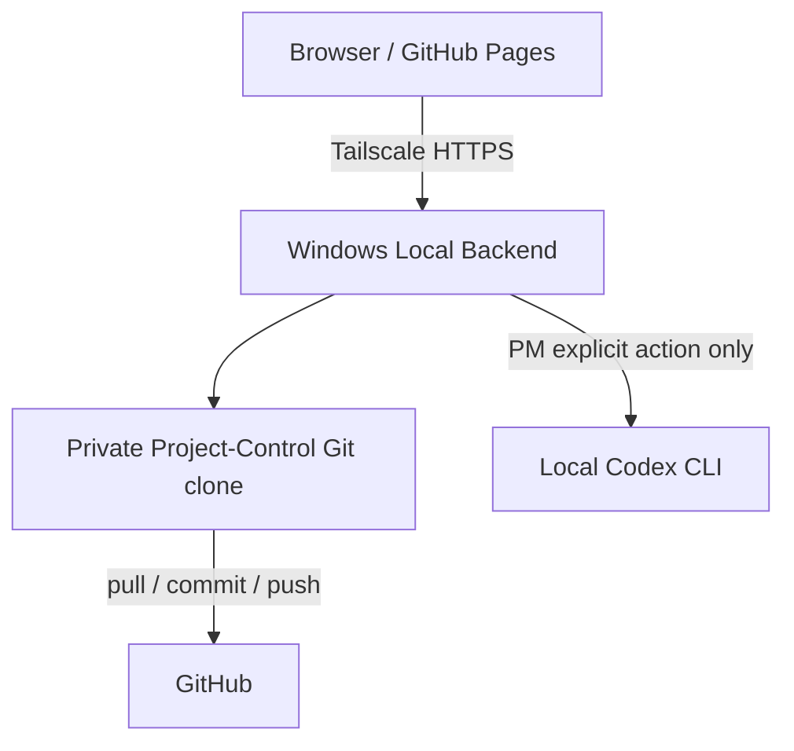

# SmartPort Progress Hub

SmartPort 專案的規劃、進度、Checkpoint、安全追溯與週報審核介面。

`feature/local-ai-weekly` 的 v0.7 架構以 **Windows 本機後端取代 Cloudflare Worker 部署**：正式資料直接來自本機的 Private `SmartPort-Project-Control` Git clone；週報只在 PM 明確按下按鈕後，才會呼叫同一個 Windows 帳號登入的 Codex CLI。

## v0.7 架構



- Cloudflare 不在本機部署的 request path 中。
- Node 後端只 listen `127.0.0.1`，由 Tailscale Serve 提供 tailnet 內的 HTTPS。
- GitHub OAuth 繼續驗證 `smartport-ntume` membership 與 Engineer / PM 權限。
- 開頁、換頁、讀 Dashboard、Guest 登入都不會觸發 Codex。
- Local Codex 預設 PM-only、單工執行、同報告去重、最多保留 5 個 active jobs。
- AI 只建立 Proposed Updates；正式 WP / Subtask baseline 仍須 PM 核准。
- Public snapshot 預設關閉。

> 「Local Codex」是指 Codex CLI 與登入憑證在 Vincent 的電腦上執行，不代表模型離線運算。週報文字與必要的 project context 仍會透過 Codex 送到 OpenAI 服務；本方案不需要把 `OPENAI_API_KEY` 放在後端。

## 開始使用

完整 Windows 安裝與驗證步驟請看 [Local Backend Windows Setup](docs/LOCAL_BACKEND_WINDOWS.md)。最短流程如下：

```powershell
git clone --branch feature/local-ai-weekly https://github.com/smartport-ntume/SmartPort-Progress-Hub.git
Set-Location SmartPort-Progress-Hub
npm install
Copy-Item .env.example .env.local

New-Item -ItemType Directory -Force .runtime | Out-Null
git clone --branch main https://github.com/smartport-ntume/SmartPort-Project-Control.git .runtime/SmartPort-Project-Control

codex login
tailscale serve --bg 8787
```

填好 `.env.local` 的 Tailscale URL、GitHub OAuth Client ID / Secret 與 `SESSION_SECRET` 後：

```powershell
npm run doctor
npm test
npm start
```

其他 tailnet 成員可直接開 `https://<computer>.<tailnet>.ts.net`。若沿用 GitHub Pages，第一次用：

```text
https://smartport-ntume.github.io/SmartPort-Progress-Hub/?apiBase=https://<computer>.<tailnet>.ts.net
```

瀏覽器會記住後端 URL；本機電腦離線時，GitHub Pages 仍可開啟，但受保護的專案資料與操作不會載入。

## 權限與觸發規則

| 身分 | 專案讀取 | 編輯 baseline | 週報 / Proposal | 觸發 Local Codex |
|---|---:|---:|---:|---:|
| Guest | 是，唯讀 | 否 | 否 | 否 |
| Engineer | 是 | 否 | Manual Proposal | 否（預設） |
| PM | 是 | 是 | Review / Approve | 是，需按下按鈕 |

如確定要讓 Engineer 也能使用本機 Codex，可在 `.env.local` 設定 `LOCAL_CODEX_REQUIRE_PM=false`。

## 資料完整性與安全邊界

- `.env.local`、Codex 工作目錄、job history 與 managed clones 都在 `.gitignore` 中。
- HTTP static server 只公開 `index.html`、`js/`、`css/` 與明確允許的 public snapshot；不會公開環境檔、Git metadata 或後端程式碼。
- Private Project-Control 使用專用 clone。寫入前執行 fast-forward pull、檢查 clean worktree 與 Git blob SHA，再 atomic write、commit、push。
- Codex 收到的只有抽出的週報文字與當次 project context；CLI 使用 ephemeral、read-only sandbox、JSON Schema，並移除後端 secrets 的環境變數。
- `.docx` 在本機解析；舊 `.doc` 需安裝 LibreOffice，否則請先轉成 `.docx`。
- Public snapshot 是固定 allowlist 的去敏感化資料，且 `PUBLIC_SNAPSHOT_ENABLED=false` 為預設值。

若 PM 明確發布過 public snapshot，可用 `?publicSnapshot=1` 進入不依賴本機後端的有限唯讀模式；未加這個參數時不會自動 fallback，避免使用者誤把公開快照當成最新正式資料。

## 開發驗證

```powershell
npm run check
npm test
```

測試包含 Git commit/push、stale SHA conflict、路徑與 symlink 防護、Local GitHub adapter、PM-only Codex、單工 queue、重複工作抑制、CORS、static allowlist 與 snapshot 去敏感化。

## Repositories

- Frontend / Local Backend: `smartport-ntume/SmartPort-Progress-Hub`
- Source of Truth: `smartport-ntume/SmartPort-Project-Control`（Private）

舊 Cloudflare 設定仍保留在 `worker/wrangler.toml`，只作 rollback 參考；v0.7 的預設前端與啟動流程不依賴 Cloudflare 部署。
