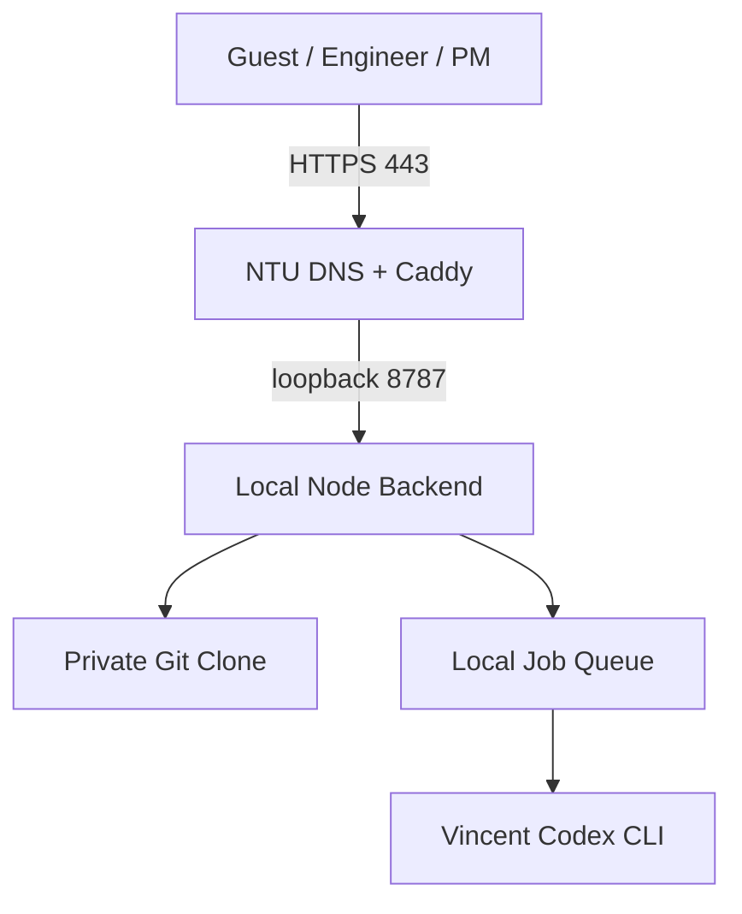

# SmartPort Progress Hub — NTU Local Backend

此分支實作不依賴 Cloudflare、Tailscale 或 Supabase 的公開部署：使用者直接開啟實驗室網域，Caddy 提供 HTTPS，再把流量反向代理到 Windows 本機後端。



## 核心規則

- 對外只開 80/443；Node 固定監聽 `127.0.0.1:8787`，Git、Codex 與檔案系統不直接公開。
- Guest 顯示內容與目前 `main` Guest 相同且唯讀；Engineer 可送 Proposal；PM 可修改與審核。
- Local Codex 必須同時符合 PM 權限及 `LOCAL_CODEX_ALLOWED_LOGINS` 白名單。
- 開啟或瀏覽網頁不會觸發 Codex；只有白名單使用者明確提交週報才會建立工作。
- 專案資料位於本機 managed Git clone，工作紀錄位於 `.runtime/jobs/history.json`；不需要額外 SQL 資料庫。

## 對外依賴

執行中的網站不使用 Supabase、Cloudflare 或 Tailscale。GitHub 仍負責 Engineer/PM OAuth、Organization/Repo 權限、Issues 與 Git remote；Codex CLI 分析時仍會連接 OpenAI。

## 開始部署

完整步驟請看 [NTU / Lab Public Local Backend](docs/NTU_LOCAL_BACKEND_WINDOWS.md)。基本流程：

1. 向實驗室網管確認固定 Public IP、TCP 80/443 與網域。
2. Router 將 80/443 轉發到後端電腦；不要轉發 8787。
3. 安裝 Git、Node.js 22、Caddy、GitHub CLI 與 Codex CLI。
4. Clone 此分支與 Private Project-Control，設定 `.env.local`、`.env.caddy`、GitHub OAuth。
5. 執行：

```powershell
npm install
npm run check
npm test
npm run doctor
npm start
```

另一個系統管理員 PowerShell 啟動 Caddy：

```powershell
caddy run --config deploy/Caddyfile --envfile .env.caddy
```

DNS 與 Port Forwarding 生效後執行：

```powershell
npm run probe
```

## 分支關係

- `main`：目前正式網站。
- `feature/local-ai-weekly`：Supabase Gateway 方案。
- `feature/ntu-local-backend`：本分支，NTU／實驗室 Port Forwarding + Caddy 方案。

## Repositories

- Frontend / Local Backend：`smartport-ntume/SmartPort-Progress-Hub`
- Source of Truth：`smartport-ntume/SmartPort-Project-Control`（Private）
