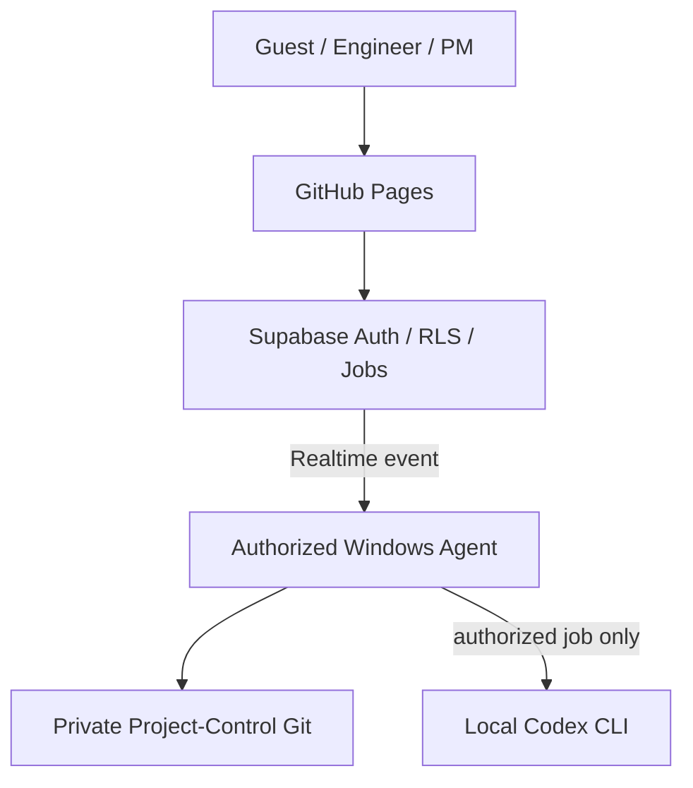

# SmartPort Progress Hub

SmartPort 專案的規劃、進度、Checkpoint、安全追溯與週報審核介面。

正式網站：<https://smartport-ntume.github.io/SmartPort-Progress-Hub/>

目前 `main` 為 v0.8 **Supabase Gateway + Windows Local Agent** 架構。一般使用者只需開啟網站，不必安裝程式、Tailscale，也不會直接連入 Agent 電腦。

## 使用方式

| 身分 | 登入方式 | 權限 |
|---|---|---|
| Guest | 專案管理者提供的訪客密碼 | 唯讀查看 Dashboard、Project、Requirements |
| Engineer | GitHub Login，且帳號已由管理者核准 | 查看完整資料、提交 Manual Proposal |
| PM | GitHub Login，且帳號已由管理者核准 | 編輯、審核與核准 Proposal |
| Codex operator | PM 且另有 `can_trigger_codex` 權限 | 上傳週報並排入本機 Codex 分析 |

GitHub 帳號第一次登入時預設為 `DENIED`；管理者必須在 Supabase 明確指定角色後才會開放。Guest 密碼與任何私密金鑰不得寫入此 repository。

## 系統架構



- Private Git 保存正式進度與原始 Word；Supabase 保存登入權限、介面快照、工作佇列、週報批次與版本回饋、稽核資料。
- Windows Agent 持有 Private Git、GitHub Issues 與 Codex 權限，只建立對外 HTTPS / WebSocket 連線，不開公開 port。
- 開啟網頁與讀取既有快照不會啟動 Codex，也不需要 Agent 當下在線。
- Agent 離線時，需要寫入或分析的工作會留在 `gateway_jobs`；Agent 恢復連線後依序處理。
- Agent 使用 Realtime `INSERT` 事件；啟動或斷線重連時只補查一次未處理工作，不做 interval polling。
- Codex 只產生 Proposal；正式進度仍須 PM 檢查並 Approve。

## 成員與分工

PM 可在 **設定 / 備份 → 成員與分工** 維護專案名單與責任分派。名單只需要姓名與負責分類，不需要 GitHub 帳號或 email。

- 預設分類為 `CTL`（控制）、`LOC/NAV`（定位＋導航）、`PER`（感知）、`STM`（狀態機＋任務）；名稱、顏色與啟用狀態可調整。
- 已被既有 WP / Subtask 使用的其他分類會自動保留，例如 `VERIFY`，避免讀取舊資料時遺失工作。
- 每個工作分類指定一位主要負責人；同一人可負責多個分類，WP 與 Subtask 依既有分類自動繼承，不需要逐項分派。
- 使用中的分類若未設定負責人會明確標示。個人週報範圍預覽會自動列出該成員所負責分類中，已逾期未完成，以及下一個 CP 檢核前應完成的 Subtask。
- 儲存後由 Supabase Gateway 交給 Windows Agent，寫入 Private Project-Control repository 的 `project/team_config.json` 並 commit / push。
- Guest 快照只保留分類名稱與顏色；成員姓名與分類負責人對應只提供給 Engineer / PM。

首次部署此功能前，請先在 Supabase SQL Editor 執行：

```text
supabase/migrations/202609080001_team_config.sql
```

接著更新並重啟 Windows Agent，再以 PM 帳號儲存第一份成員與分工設定。

## 週報分析

1. 以具有 Codex 權限的 PM 登入。
2. 前往 **Workflow → Weekly Reports**。
3. 選擇報告日期與成員。系統會合併該成員負責的所有分類，列出已逾期未完成，以及從報告日到下一個 CP 檢核前應完成的 Subtask。工作若被指定到該 CP 或更早 CP，也會納入；若已無後續 CP，則僅列逾期項目。
4. 按 **下載此人的 Word 週報**。首頁會先顯示下一個 CP 的主題、日期、倒數天數、車輛能力（Capability）、Review / Check 與任務摘要；Word 並會帶入姓名、分類、工作 ID、計畫期間、目前進度與預期成果，成員直接填寫成果、證據、風險及下一步。
5. 填好後回到同一頁、選擇同一位成員並上傳不超過 10 MB 的 `.docx`；舊 `.doc` 需由 Agent 電腦安裝 LibreOffice。
6. 按 **上傳並批改**。Agent 會先把原始週報歸檔到 Private Git，再刪除 Supabase Storage 暫存檔。
7. 本機 Codex CLI 會核對 Private Git 中的最新分工與甘特圖，給出完整度、證據品質、時程一致性三項分數及具體補充建議；有足夠依據的內容才會建立 Proposal，最後仍由 PM 決定是否核准。

瀏覽器傳來的成員名稱、分類與任務範圍不被視為可信資料。Agent 會依 `project/team_config.json`、`project/work_packages.json`、`project/subtasks.json`、`project/checkpoints.json` 與 `project/reference_model.json` 重新計算該人的負責分類、應填範圍及下一個 CP 的檢核依據，避免漏項或跨組更新。手動與自動收件都沿用既有 `analyze_weekly_report` job，不會啟動另一套批改邏輯。

這是「在本機執行 Codex CLI」，不是離線模型。分析時，抽出的週報文字與必要 project context 會由 Codex CLI 傳送至 OpenAI 服務。

### 每週自動建立、Discord 發布與收件

啟用後，持續運行的 Windows Agent 會在每週一 13:00（`Asia/Taipei`）建立當週批次，從 Private Git 凍結當下的甘特圖、Checkpoint 與成員分工，為每位應繳成員產生個人 `.docx`，並直接附加到 Discord 訊息。成員在 Discord 下載與自己姓名相同的 Word，填寫後直接開啟訊息中的當週專用網址、選擇姓名並上傳；不需要 GitHub 帳號或訪客密碼。入口頁會在背景建立獨立的 Supabase 匿名工作階段，也可重新下載同一格式的空白週報，並顯示全員的繳交／批改狀態；Agent 離線時工作留在 Supabase，恢復後再自動批改，最後仍進入既有 PM Review Queue。

當 PM 修改既有成員姓名時，Agent 會把新名字同步到仍在收件期限內的週報批次與催繳名單，但不改動當週凍結的分類、任務與 CP 範圍。已發到 Discord 的舊附件不會被重貼；從週報入口重新下載即可取得新姓名版本。

預設截止時間是次週一 12:00，並保留七天補交期。每則 Discord 訊息最多附五份 Word，人數較多時會自動分批；Agent 會記錄已送出的批次，重啟後從未完成的下一批續送。若 Agent 在發布時間關機，只要在下一個發布週期前重新啟動就會補發。可選的每日催繳只列出尚未成功上傳的姓名與上傳網址，不會重複附檔或自動 mention Discord 帳號。

首次部署自動收件前，在 Supabase SQL Editor 依序各**執行一次**：

```text
supabase/migrations/202609100001_weekly_discord_automation.sql
supabase/migrations/202609100002_passwordless_weekly_portal.sql
```

若第一份已經執行，只需再執行 `202609100002_passwordless_weekly_portal.sql`。接著到 Supabase **Authentication → Providers → Anonymous Sign-Ins** 開啟匿名登入；這只供持有當週私密網址的週報入口使用，不會讓匿名使用者看到主網站資料。

然後在 Agent 電腦的 `.env.local` 加入：

```dotenv
WEEKLY_AUTOMATION_ENABLED=true
WEEKLY_DISCORD_WEBHOOK_URL=https://discord.com/api/webhooks/...
WEEKLY_REPORT_PM_LOGIN=YOUR_PM_GITHUB_LOGIN

# 選用；預設不催繳
WEEKLY_REMINDER_ENABLED=false
```

Webhook 是密鑰，只能放在 `.env.local`。每週不需要再執行 SQL、手動建立 Codex 指令或新增 Windows 排程；原本常駐的 `npm start` Agent 會負責排程。當週的隨機 token 網址就是繳交憑證，拿到網址的人可以選擇任一姓名，因此只能發布在受控的 Discord 頻道，不能轉貼；需要不可否認性時才應改成每人登入或個人 PIN。

### PM 週報管理中心與成員回饋

PM 登入後，**Workflow → Weekly Reports** 首先顯示自動週報批次的管理中心。原有的手動產生／上傳與提案紀錄收在下方展開區。

- 依週次、成員及狀態查看未繳、待審、退回補件、失敗與已核准；可載入更早週次。
- 點選某人的週報，查看原始 Word 連結、完整度／證據品質／時程一致性分數、缺漏、建議、提交版本及批改執行紀錄。
- 勾選要採用的進度更新，核對目前值與提案值後，按 **核准勾選項目並結案**。未勾選項目記為未採用；沒有進度更新的週報也可以結案。**退回補件** 必須填寫原因，不寫入正式進度；退回後需重新批改或補交新版才能再次審核。
- **重新批改原始週報** 會使用已歸檔的 Word，不依賴已刪除的 Storage 暫存；需要 `can_trigger_codex`。已核准版本不能重新批改，需補交新版。
- **補發 Discord** 會重送當週附件與原連結；**展延截止** 以台灣時間操作，補交期限至少延至新截止日七天後。展延不自動發送訊息，需通知時再按補發。

成員沿用 Discord 的免密碼入口，選擇姓名即可看到分數、缺漏、建議、PM 回饋及歷史版本。批改完成、PM 審核中、退回補件、已核准是不同狀態。入口仍是原本的共用批次憑證：持有連結者可以切換成員查看回饋，請維持受控頻道使用；本版沒有增加 Discord 帳號綁定。

同一人同一批次補交時，系統產生新版本，舊的未核准提案失效，已核准歷史保留。審核排入佇列後會鎖住該版本，防止補交與核准互相覆蓋。Agent 會在寫入前重新確認工作進度及狀態；若審核中斷，管理中心顯示 **重試剩餘審核**，保留已完成決定，並可取消尚未採用的過時項目。批次更新可能包含多次 Git／Issue 寫入，因此保留明確的部分完成紀錄。

批改回饋保存在 `weekly_report_submissions`，執行歷史保存在 `weekly_report_analysis_runs`，不隨 30 天工作佇列清理而刪除。升級會取回仍存在於工作佇列中的舊批改結果；已經被清除的舊評分無法還原。

**既有系統升級順序：**

1. 先停止 Windows Agent，於 Supabase SQL Editor **執行一次** `supabase/migrations/202609110002_weekly_review_cycle.sql`（前三份 Gateway／team／weekly 及免密碼入口 migration 必須已執行）。
2. 合併並取得此版程式，執行 `npm install`、`npm run check`、`npm test`、`npm run doctor`。
3. 重啟 Agent，重新整理主網站與週報入口。Doctor 會檢查 `Weekly review cycle migration`。

測試使用本機 PGlite PostgreSQL 執行完整 migration 與角色、版本、重試流程，不會連線到正式 Supabase 或發送 Discord 訊息。

## 維運者快速開始

完整的 Supabase、角色、GitHub OAuth、`.env.local` 與 Windows Task Scheduler 設定，請看 [Supabase Gateway Windows Setup](docs/SUPABASE_GATEWAY_WINDOWS.md)。

在授權的 Windows 帳號下安裝 Agent：

```powershell
git clone --branch main https://github.com/smartport-ntume/SmartPort-Progress-Hub.git SmartPort-Progress-Hub-Agent
Set-Location SmartPort-Progress-Hub-Agent
npm install
Copy-Item .env.example .env.local

gh auth login
gh auth setup-git
codex login
```

填妥本機專用的 `.env.local` 後驗證並啟動：

```powershell
npm run check
npm test
npm run doctor
npm start
```

成功時會顯示：

```text
SmartPort Supabase Agent connected
Mode: Realtime events + reconnect catch-up; no interval polling
Weekly Discord automation: enabled
```

正式運行應使用 Windows Task Scheduler 啟動 `scripts/start-agent.ps1`。本機預覽 `npm run preview` 只供開發測試，一般使用者應直接開正式網站。

## 安全與免費額度護欄

- `SUPABASE_SERVICE_ROLE_KEY`、GitHub credential、Codex 登入資料只留在 Agent 電腦，不得進入前端、README、Issue 或 commit。
- `can_trigger_codex` 是獨立權限，預設關閉，只開給指定 operator。
- 不使用 Edge Functions、VPS、自訂網域或付費 add-on；Supabase project 應維持 Free plan。
- job payload/result 上限 4 MB、snapshot 上限 5 MB、週報單檔上限 10 MB。
- 已完成 job 保留 30 天、audit metadata 保留 90 天；Agent 啟動及每次工作完成後執行清理。
- 週報完成 Private Git 歸檔後立即刪除 Supabase Storage 暫存檔。
- Discord webhook 與每週批次 token 不寫入前端設定或 Private Git；附檔與批次網址只應發布到受控的專案頻道。

## 驗證

```powershell
npm run check
npm test
npm run doctor
```

測試涵蓋 Git 寫入衝突與 symlink 防護、內部 GitHub adapter、PM-only/Codex 權限、Realtime 事件處理、個人週報範圍與 Word 產生、每週台灣時區排程與補發、Discord 個人 `.docx` 附件分批／續送與催繳、token 限定的一次性上傳、Private Git 端重新驗證分工與範圍、週報先歸檔後刪除暫存、CORS、static allowlist、未登入資料保護，以及 Guest 唯讀快照。

## 回復點

- 現行正式版本：`main`
- Supabase 上線前的舊 `main`：[`backup/main-before-supabase-2026-09-07`](https://github.com/smartport-ntume/SmartPort-Progress-Hub/tree/backup/main-before-supabase-2026-09-07)
- 舊版 branch 只作歷史回復點，不會跟隨 `main` 更新。
- 舊的 loopback HTTP backend 仍可用 `npm run start:local` 啟動；相關文件見 [Local Backend Windows](docs/LOCAL_BACKEND_WINDOWS.md)。

## Repositories

- Frontend / Local Agent：`smartport-ntume/SmartPort-Progress-Hub`
- Source of Truth：`smartport-ntume/SmartPort-Project-Control`（Private）
